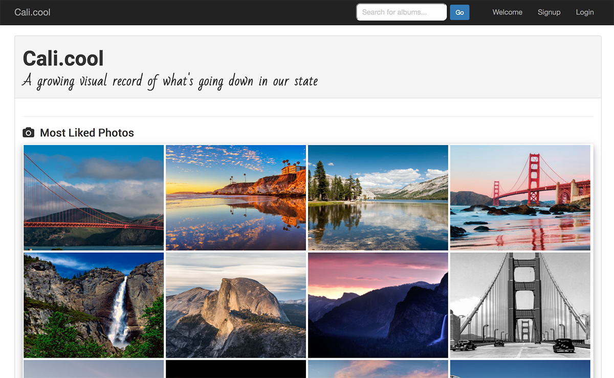

# Cali.cool

**Live application: www.cali.cool**

## Synopsis

Cali.cool is a photo sharing app for Californians by Californians, a visual platform for sharing the California experience. The collection of photographs is open for public viewing, but requires a user login to share photos, as well as to like and comment on photos and albums.

## User Story

As a Californian, I want to upload photos to a California-oriented photo app so that I can share photos which express life in California with other residents.

## Motivation

As creators of Cali.cool, we want a platform that is welcoming and encouraging to all those who love and want to share their experiences in and of California.

## Visual Application Walkthrough 

[](https://youtu.be/6mco_9hX3A4)


[MP4 Video Walkthrough](calicool-walkthrough_20171210.mp4)

## Technologies:

### MERN Stack
* [MongoDB](https://www.mongodb.com/) - Document-oriented NoSQL database
  * [Mongoose](http://mongoosejs.com/) - Schema solution for MongoDB
* [Express](https://expressjs.com/) - Application framework/server
* [React.js](https://reactjs.org/) - JavaScript library for building user interfaces
  * [React Router](https://github.com/ReactTraining/react-router) - Declarative routing for React
  * [Yarn](https://yarnpkg.com/en/) - Dependency management
* [Node.js](https://nodejs.org/en/) - JavaScript runtime engine
  * [Passport.js](http://www.passportjs.org/docs/) - Authentication middleware
  * [Axios](https://www.npmjs.com/package/axios) - Promise based HTTP client

### Hosting
* [Heroku](https://heroku.com) - Application hosting
  * [MLab](https://elements.heroku.com/addons/mongolab) - MongoDB hosting
  * [PointDNS](https://devcenter.heroku.com/articles/pointdns) - Domain management
* [Cloudinary](https://cloudinary.com/) - Cloud-based image management

## Installation

1. Clone repo and install NPM packages:

    ```
    git clone https://github.com/dbmarshall/cali-cool
    cd cali-cool/
    yarn install 
    cd client/
    yarn install 
    cd ../
    ```

2. Start server (local environment only):

    ```
    yarn start
    ```

## Available Commands and URLs

**Local:** 

* Should live-reload upon `yarn start`: [http://localhost:3000/](http://localhost:3000/) 

**Heroku Deployment:** 

* Load [https://cali-cool.herokuapp.com/](https://cali-cool.herokuapp.com/) 
* Load custom domain name [https://cali.cool](https://cali.cool) 

## Code Highlights

### Promise-based syntax to find user by ID with Mongoose and populate with data from photos and user collections
```javascript
findById: function(req, res) {
    db.Albums
      .findById(req.params.id)
      .populate({
        path: "photos",
        populate: [{
          path: "owner",
          model: "Users",
          select: ["_id", "userName"]
        },
        {
          path: "album",
          model: "Albums",
          select: ["_id", "title"]
        }]
      })
      .populate("owner")
      .populate({
        path: 'comments',
        options: {
          sort: {
            dateUpdated: -1
          }
        },
        populate: {
          path: 'user',
          model: 'Users'
        }
      })
      .then(dbModel => res.json(dbModel))
      .catch(err => res.status(422).json(err));
  }
```

### Creating a new photo w/ Cloudinary API
```javascript
createPhoto: function(req, res) {
    cloudinary.uploader.upload(req.body.data_uri, function(result) { 
      imageUploadId = result.public_id;
      newObj = req.body;
      delete newObj['data_uri'];
      newObj.imageUploadId = result.public_id;
      db.Photos
        .create(newObj)
        .then(dbModel => res.json(dbModel))
        .catch(err => res.status(422).json(err));
    }, 
      { upload_preset: "ccu" });
  }
```

## Authors

* **Minu James** ([minujames.com](http://minujames.com/))
* **Josh Siverson** ([siverson90.github.io](https://siverson90.github.io/))
* **David Morse** ([marshall.media](http://www.marshall.media/))

## License

This project is licensed under the MIT License - see the [LICENSE.md](LICENSE.md) file for details

